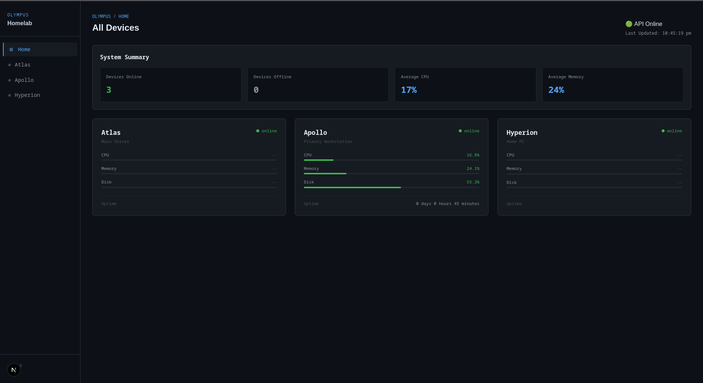

# Olympus

A self-hosted infrastructure monitoring dashboard built to provide a centralised view of my personal homelab environment.

Olympus is designed as a lightweight NOC-style dashboard for monitoring devices, services, and system health across my local network. The goal is to build a complete observability platform while exploring full-stack development, networking, Linux administration, and infrastructure automation.

## Current Status

Olympus is currently in active development.

The dashboard currently supports:

* Live device discovery through a backend API
* Device status monitoring
* CPU, memory, and disk utilisation display
* Uptime reporting
* System-wide summary statistics
* Responsive dashboard layout
* Dark themed NOC-inspired interface

## Dashboard Preview



## Architecture

Olympus uses a separated frontend and backend architecture:

```
                ┌──────────────────┐
                │   Olympus UI     │
                │  Next.js React   │
                └────────┬─────────┘
                         │
                         │ REST API
                         │
                ┌────────▼─────────┐
                │ Olympus Backend  │
                │    FastAPI       │
                └────────┬─────────┘
                         │
                         │
              ┌──────────┴──────────┐
              │                     │
        Homelab Devices       System Metrics
```

## Features

### Device Monitoring

Each registered device displays:

* Device name
* Device role
* Online/offline state
* CPU utilisation
* Memory utilisation
* Disk utilisation
* System uptime

Example devices:

| Device   | Role                         |
| -------- | ---------------------------- |
| Atlas    | Always-on server             |
| Apollo   | Development workstation      |
| Hyperion | Gaming / compute workstation |

### System Summary

The dashboard calculates global statistics directly in React:

* Devices online
* Devices offline
* Average CPU utilisation
* Average memory utilisation

Example:

```
System Summary

Devices Online     3
Devices Offline    0
Average CPU        24%
Average Memory     47%
```

## Technology Stack

### Frontend

* Next.js
* React
* TypeScript
* Bootstrap / custom styling

### Backend

* FastAPI
* Python
* REST API

### Infrastructure

* Ubuntu Server
* Docker
* Tailscale
* Linux administration tools

## Project Goals

Future development plans include:

* [ ] Real-time metric updates
* [ ] Historical performance graphs
* [ ] Service monitoring
* [ ] Docker container monitoring
* [ ] Network status monitoring
* [ ] Authentication and user accounts
* [ ] Alerting system
* [ ] Mobile-friendly interface
* [ ] Automated device discovery

## Why Olympus?

Olympus is a personal infrastructure project focused on building practical experience with:

* Full-stack software engineering
* Backend API design
* System monitoring
* Networking
* Linux servers
* DevOps practices

The project acts as both a useful homelab tool and a continuous learning environment.
